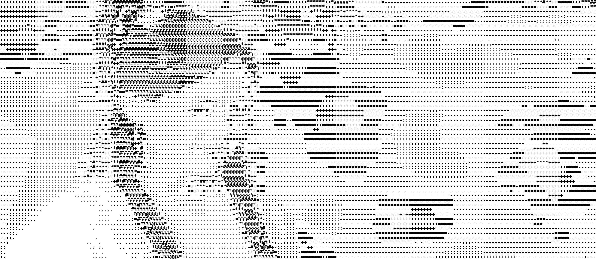

# [PYTHON] ASCII generator

## Introduction

为ASCII生成器项目创建的UI网页和Windows应用程序

这个仅仅是添加了网页UI和windows应用程序，

原地址为：https://github.com/vietnh1009/ASCII-generator

在现代编程和设计的环境中，用户体验是提高工具和应用程序受欢迎程度的重要因素。最近，我为ASCII生成器项目（ASCII-generator）开发了一个用户友好的网页界面和Windows桌面应用程序。这些新功能旨在使用户能够更轻松地访问和使用这个强大的工具。

项目背景 ASCII生成器是一个开源项目，允许用户将图片转换为ASCII艺术。虽然这个工具的核心功能非常强大，但其原有的命令行界面对许多用户来说并不友好。因此，我决定为该项目提供一个更直观的用户界面，希望能吸引更多用户尝试并使用这个有趣的工具。

UI网页的设计 我设计的网页界面简单直观，用户可以在首页直接上传图片，选择所需的ASCII字符集及输出格式。网页使用了HTML、CSS和JavaScript构建，确保了在不同设备上的良好兼容性。用户只需点击几下就能将自己的图片转换为ASCII艺术，同时可以实时预览效果。这种交互方式大大降低了用户的学习成本，同时也提升了整体的使用体验。

Windows应用程序的功能 除了网页界面，我还开发了一个Windows应用程序。这个应用程序同样提供了简洁的用户界面，支持拖拽图片上传，用户可以更方便地选择文件进行处理。应用程序在后台使用了ASCII生成器的API，确保了转换的准确性和速度。同时，我还添加了一些实用的小功能，比如保存转换结果为文本文件以及调整字符密度，方便用户根据自己的需求进行调整。

收获与反馈 在开发过程中，我遇到了一些挑战，比如如何保持界面的清晰性和功能的丰富性之间的平衡。经过反复测试和改进，我认为最终的结果还是很不错的。用户的反馈也很积极，他们觉得新的UI设计让操作变得更加流畅和愉快。

结语 通过为ASCII生成器项目创建网页和Windows应用程序，我不仅提升了项目的可用性，也实现了自己在前端开发和桌面应用开发方面的成长。我希望这些新功能能让更多人体验到ASCII艺术的乐趣，也欢迎大家继续参与这个开源项目，为它的发展贡献你们的力量！

## Multiple Language Conversion
We could generate ASCII art with different alphabets (english, german, french, korean, chinese, japanese, ...). Below are example output:

   
  <i>English</i>

   
  <i>Japanese (Dragon Ball)</i>

   
  <i>German</i>

   
  <i>Korean (Dae Jang-geum)</i>

   
  <i>French</i>

   
  <i>Chinese (Actress)</i>

   
  <i>Spanish</i>

   
  <i>Russian</i>

## Video to video
By running the sript **video2video_color.py** or **video2video.py** with different values for *background* and *mode*, we will have different outputs, for example:

   
  <i>Colored complex-character ASCII output</i>

   
  <i>White-background simple-character ASCII output</i>

## Image to text
By running the sript **img2txt.py** with different values for *mode*, we will have following outputs:

   
  <i>Input image</i>

   
  <i>Simple character ASCII output</i>

   
  <i>Complex character ASCII output</i>

## Image to image
By running the sript **img2img_color.py** or **img2img.py** with different values for *background* and *mode*, we will have following outputs:

   
  <i>Input image</i>

   
  <i>Colored complex-character ASCII output</i>

   
  <i>White-background simple-character ASCII output</i>

   
  <i>Black-background simple-character ASCII output</i>

   
  <i>White-background complex-character ASCII output</i>

   
  <i>Black-background complex-character ASCII output</i>

## Requirements

* **python 3.6**
* **cv2**
* **PIL** 
* **numpy**
